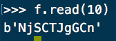
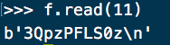
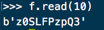
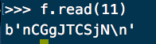

# 存储管理问题 - 文件字节倒放问题

* 无42 林子恒 2014011054
* Brian Lin,Tzu-Heng's Work
  * Mailto: [lzhbrian@gmail.com](lzhbrian@gmail.com)
  * Github: [lzhbrian](github.com/lzhbrian)
  * Linkedin: [lzhbrian](linkedin/in/lzhbrian)

[TOC]

## 一、问题描述

* 生成一个由随机产生的字符型数据组成大的数据文件（例如，大小$\geq1GB$）。将该文件中的所有字节进行倒放，存入原文件，即将文件中的首字节与尾字节对换，次字节与次尾字节对换，以此类推。
* 编写两个程序，一个程序采用常规的文件访问方法，另一个程序采用内存映射文件方法。请记录两种方法完成字节倒放所需要的时间，并进行比较。

### 1. 实验环境

- 操作系统平台可选Windows或Linux，编程语言不限。

### 2. 函数参考

* Windows：CreateFileMapping创建一个文件映射对象，MapViewOfFile将文件映射对象映射到当前进程的地址空间，UnmapViewOfFile在当前进程的内存地址空间解除对一个文件映射对象的映射；
* Linux：mmap把一个文件映射到当前进程的地址空间，munmap解除内存映射。

<div style="page-break-after: always;"></div>

## 二、实现

### 1. 思路：

- 我们采用python实现此次实验。
- 调用numpy库里的$memmap()$函数，将文件映射到内存；然后直接将反转后的内存数据覆盖写原数据，即完成了对1GB字符文件的反转操作。

### 2. 产生一个大小为1GB的字符文件：

- 我们首先编写 python 程序`generate_1g_file.py`来生成$10^9$个字符，大小为1GB，将其写入`./one_gig_file.txt`里面，代码如下：

  ```python
  fp = open('./data/one_gig_file.txt','w')
  data_length = 10000000
  from random import Random
  def random_str(randomlength=8):
  	str = ''
  	chars = 'AaBbCcDdEeFfGgHhIiJjKkLlMmNnOoPpQqRrSsTtUuVvWwXxYyZz0123456789'
  	length = len(chars) - 1
  	random = Random()
  	for i in range(randomlength):
  		str += chars[random.randint(0, length)]
  	return str
  for x in range(1,101):
  	a = random_str(data_length)
  	print(a, file=fp, end='')
  print('Finished ', x, ' times')
  ```

### 3. 常规缓冲区方法实现文件字节倒放

* 采用缓冲区的方式实现的基本思路为：

  * 取文件前 $buffersize$ 个字节与后 $buffersize$ 个字节，反转之后交换
  * 如此重复，直到将文件全部取完。

* 代码如下：

  ```python
  import sys
  buffer_size = sys.argv[1]

  f1 = open('./data/one_gig_file.txt','r+')
  f2 = open('./data/one_gig_file.txt','r+')
  # f1 = open('./data/small_file.txt','r+')
  # f2 = open('./data/small_file.txt','r+')

  # inverse the data in buf1 & buf2
  def inverse_buf(buf1, buf2):
    	temp1 = buf2[::-1]
    	temp2 = buf1[::-1]
    	return [temp1, temp2]

  # f2: move cursor to file end
  f2.seek(0,2)
  f2.seek(-1,1) # if \n is in last data

  while 1:
    	# f1, from front
    	buf1 = f1.read(buffer_size).decode('UTF-8')
    	# f2, from end
    	f2.seek(-buffer_size,1)
    	buf2 = f2.read(buffer_size).decode('UTF-8')

    	# inverse buf1, buf2
    	[buf1, buf2] = inverse_buf(buf1, buf2)

    	# write f1
    	f1.seek(-buffer_size,1)
    	f1.write(buf1)
    	# write f2
    	f2.seek(-buffer_size,1)
    	f2.write(buf2)

    	# move cursor for next
    	f2.seek(-buffer_size,1)

    	gap = f2.tell() - f1.tell()
    	if gap == 0:
    		f1.close()
    		f2.close()
    		exit()
    	elif gap < buffer_size*2: # last round
    		buffer_size = gap/2
    		# f1, from front
    		buf1 = f1.read(buffer_size).decode('UTF-8')
    		# f2, from end
    		f2.seek(-buffer_size,1)
    		buf2 = f2.read(buffer_size).decode('UTF-8')

    		# inverse buf1, buf2
    		[buf1, buf2] = inverse_buf(buf1, buf2)

    		# write f1
    		f1.seek(-buffer_size,1)
    		f1.write(buf1)
    		# write f2
    		f2.seek(-buffer_size,1)
    		f2.write(buf2)
    		break
  f1.close()
  f2.close()
  ```

### 4. 采用内存映射的方法实现文件字节倒放

* 调用numpy库里的$memmap()$函数，将文件反转之后覆盖写原数据，代码如下：

  ```python
  import sys
  import numpy as np

  # open source fike
  f = np.memmap('./data/one_gig_file.txt', mode='r+')

  # calc length
  data_length = len(f)

  # 'data_length-1' because of the \n in the last
  reversed_arr = f[0:data_length-1][::-1]

  # overwrite f
  f[0:data_length-1] = reversed_arr[:]

  # close file
  f.flush()
  ```

<div style="page-break-after: always;"></div>

## 三、实验结果

1. 通过`generate_1m_numbers.py`生成的文件为：`one_gig_file.txt`，其前10个、后10个字符分别为

   * 
   * 


2. 通过内存映射 `memmap_method.py` 或常规方法 `normal_method.py` ，反转字串后的前10个、后10个字符为：

   * 
   * 

3. 性能：

   1. 采用 $32768Byte$ 缓冲区时，常规方法所用的时间为：8.622 s
   2. 采用内存映射方法时，所用的时间为：5.266 s

<div style="page-break-after: always;"></div>

## 四、思考题

1. 采用常规的文件访问方法时，改变缓冲区的大小对程序的性能有什么影响？请用图表描述缓冲区的大小与程序性能之间的关系。
2. | 大小B  | $2^7$  | $2^9$  | $2^{11}$ | $2^{13}$ | $2^{15}$ | $2^{17}$ | $2^{19}$ | $2^{21}$ | $2^{23}$ |
   | :--: | ------ | :----: | :------: | :------: | :------: | :------: | :------: | :------: | :------: |
   | 时间s  | 83.777 | 57.660 |  31.087  |  15.584  |  8.622   |  7.612   |  7.373   |  6.754   |  7.030   |

   * 可以看到，一开始的时候，缓冲区越大，程序效率就越高
     * 但到达一定的水平之后，缓冲区变大并不会再对效率有显著的提高
   * 本测试所使用机器为：
     * 2014 late Macbook Air 8GB DDR3 RAM, 1.4GHz Intel Core i5 CPU, 256GB SSD

3. 内存映射文件方法和常规的文件访问方法在性能上有什么差异，试分析其原因。
   * 首先是实现复杂度，由上面我们实现的代码可以看到，使用内存映射的方法编写的python程序只需要7行...而使用常规方法则需要60+行才能完成，使用常规内存映射方法的工作量小很多
   * 在访问很大的文件的时候，采用内存映射效率会比使用常规的文件访问方法高很多；但在访问小文件的时候，这个优势可能就没有那么明显了，甚至可能因为调用一些函数需要花费比较多的时间。


## 五、感想

- 本来第一、第二题也想要用python来实现，但是考虑到python的多线程并不是真正的多线程，所以最后还是向C++妥协了QAQ
  - 这题终于可以使用python来实现，而且使用内存映射只用了7行的代码（得意）～
- 一开始做这道题的时候，我理解为将一个文件读入反转后写到另外一个文件里面，直到我看到了思考题里面提到的“缓冲区”。
  - 我本来是从原文件的尾部开始读取，然后一个字节一个字节的直接写入另外一个文件，其实就是相当于使用了大小为1的缓冲区
- 三次实验终于结束！感谢老师、助教的耐心帮助与批改～


